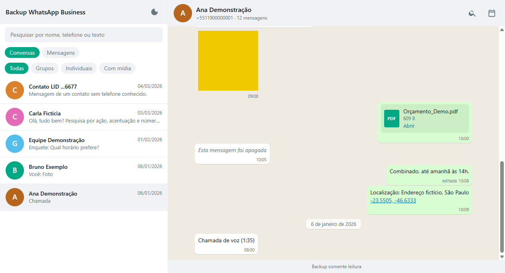

# WhatsApp Portable Viewer (guia em português)

Transforme o backup do seu **WhatsApp** ou **WhatsApp Business** (Android) em um **visualizador offline**, parecido
com o WhatsApp Web, que abre de um **pendrive** com duplo clique: sem internet, sem instalar nada no computador que
vai abrir e sem depender de ninguém.

## O que você vai ter no final

- Todas as conversas, com busca por **nome, telefone e texto**; busca dentro da conversa e "ir para a data".
- Fotos, áudios, vídeos, documentos, figurinhas, localizações, enquetes, chamadas, respostas e anúncios.
- Nomes dos contatos (quando você tiver o `wa.db` ou uma lista de contatos).
- Um **relatório** que diz quais mídias não foram encontradas e por quê.
- Um pendrive **conferido arquivo por arquivo** (SHA-256), para você não descobrir só depois que a cópia veio corrompida.

## Por onde começar

| Se você... | Faça isto |
|---|---|
| Quer o caminho mais fácil | Siga [o guia](docs/00-visao-geral.md) e, no passo do computador, use o **assistente `iniciar.bat`** |
| Quer entender cada etapa | Leia os capítulos abaixo na ordem |
| Já tem o backup e a chave | Pule para o [capítulo 3](docs/03-chave-e-descriptografia.md) |
| Quer só ver como fica | Veja [as telas da demonstração](docs/07-usando-o-visualizador.md) (dados fictícios) |

## Índice do guia

0. [Visão geral](docs/00-visao-geral.md): o que é, quanto tempo leva, o que você precisa
1. [Preparar o celular](docs/01-preparar-o-celular.md): backup com chave de 64 dígitos e cópia dos arquivos
2. [Instalar no computador](docs/02-instalar-no-computador.md)
3. [Chave e descriptografia](docs/03-chave-e-descriptografia.md)
4. [Nomes dos contatos](docs/04-nomes-dos-contatos.md)
5. [Gerar o visualizador](docs/05-gerar-o-visualizador.md)
6. [Montar o pendrive](docs/06-montar-o-pendrive.md)
7. [Usando o visualizador](docs/07-usando-o-visualizador.md)
8. [Fazer de novo com um backup novo](docs/08-novo-backup.md)
9. [Problemas comuns](docs/09-problemas-comuns.md)
10. [Como funciona por dentro](docs/10-como-funciona.md)

Também: [Segurança e privacidade](docs/seguranca-e-privacidade.md) · [Comparação com outras ferramentas](docs/comparacao.md) ·
[Créditos](docs/creditos.md)

## Resumo em 6 passos

1. **Celular:** ative o *Backup criptografado de ponta a ponta* com a **chave de 64 dígitos** e **guarde a chave** (ela aparece uma única vez).
2. **Celular:** faça um backup e copie para o computador: `msgstore.db.crypt15`, pasta `Backups`, pasta `Media` (incluindo pastas ocultas). **Exporte também os contatos** como `.vcf` (app Contatos) e como CSV (contacts.google.com) — sem isso, as conversas ficam só com número, especialmente no WhatsApp Business.
3. **Computador:** instale o **Git** e o `uv`, e baixe este projeto.
4. **Computador:** dê duplo clique em **`iniciar.bat`** e siga as instruções na tela.
5. **Pendrive:** o assistente copia e confere tudo.
6. **Usar:** abra `index.html` no pendrive.

## Por que este guia é diferente dos antigos

Tutoriais antigos exigiam *root*, o truque do "ABE", um WhatsApp antigo (APK legado) ou senhas. **Nada disso é necessário
hoje.** Desde cerca de 2022 o WhatsApp oferece uma **chave de 64 dígitos** que você mesmo guarda, e o formato do arquivo
(`crypt15`) é público. Isso foi bem resumido em uma [discussão do Reddit (r/DataHoarder)](https://www.reddit.com/r/DataHoarder/comments/a7c0yq/full_whatsapp_chat_export_40000_messages/?tl=pt-br)
e depende da ferramenta [wa-crypt-tools](https://github.com/ElDavoo/wa-crypt-tools). Aqui você encontra o processo completo, do celular ao pendrive.

## Aviso importante

Use apenas **os seus próprios backups**. Conversas contêm dados de outras pessoas: leia [Segurança e privacidade](docs/seguranca-e-privacidade.md)
antes de guardar ou compartilhar o resultado.
