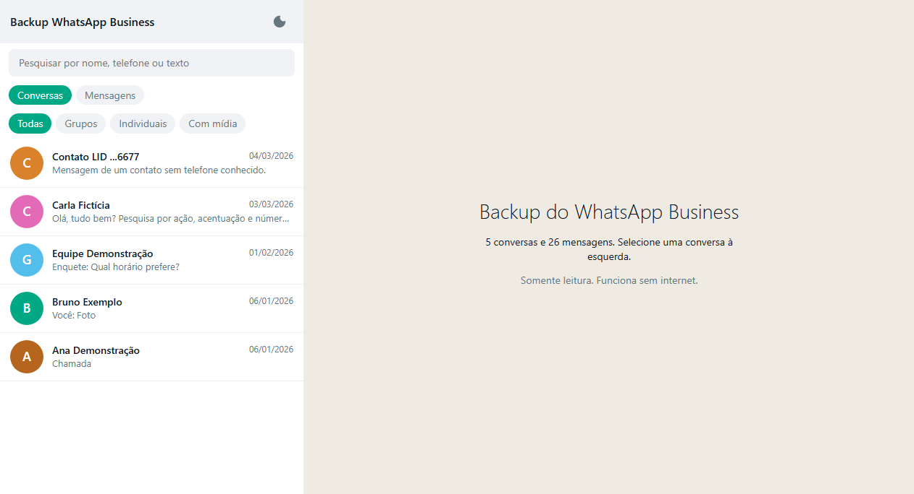
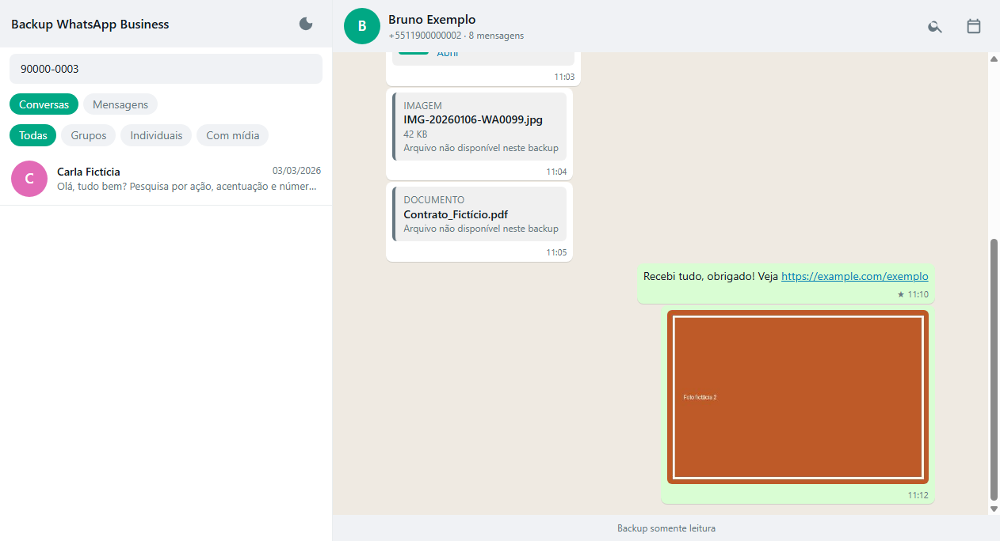
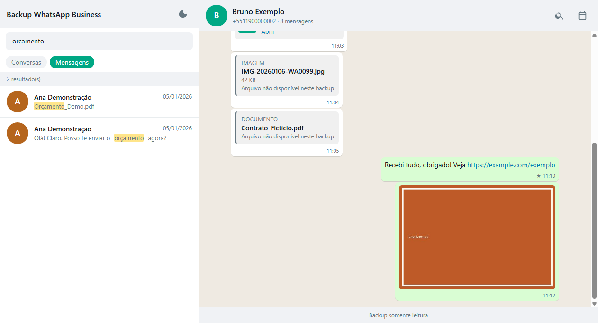
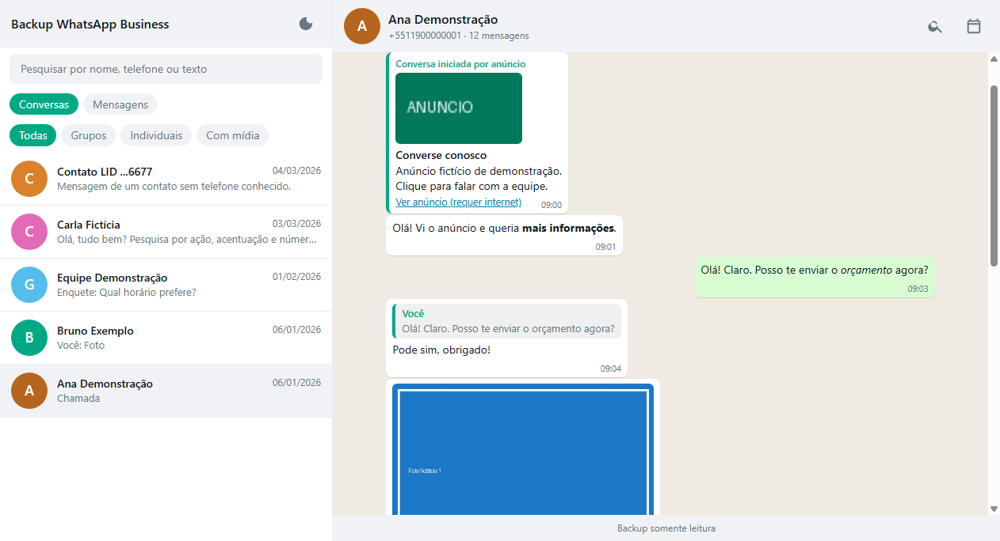
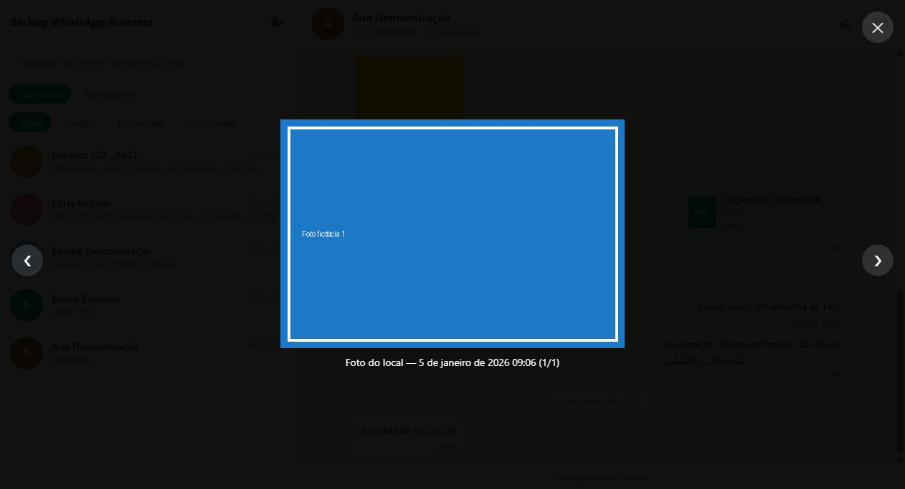
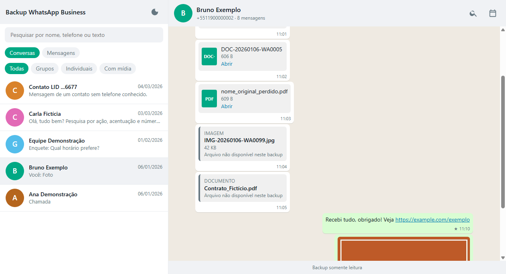
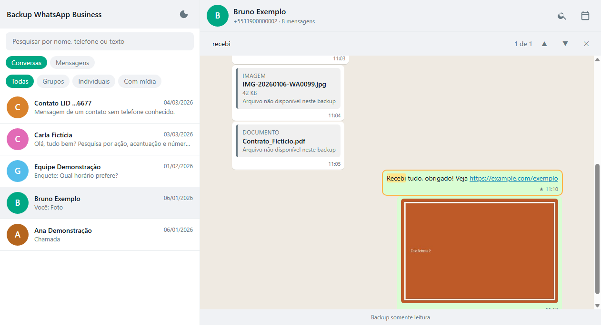
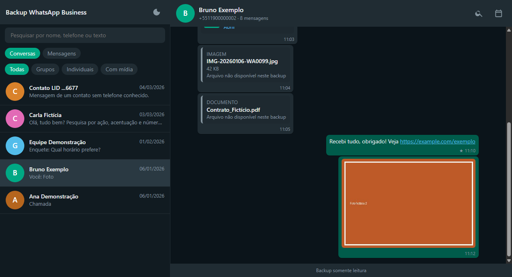

# 7. Usando o visualizador

Abra o arquivo **`index.html`** (na pasta `pendrive` ou na raiz do pendrive) com duplo clique. Funciona **sem internet**
no **Chrome, Edge ou Firefox**. As imagens abaixo são de uma **demonstração com dados 100% fictícios**.

## Lista de conversas e buscas

- **Conversas:** a lista está ordenada pela última mensagem. Clique para abrir.
- **Busca de conversas** (caixa no alto, aba *Conversas*): procura por **nome**, **telefone** (com ou sem `+`, espaços, traço
  ou parênteses) e pelo texto da última mensagem. Não diferencia maiúsculas nem acentos.
- **Filtros:** *Todas*, *Grupos*, *Individuais*, *Com mídia*.

## Buscar em todas as mensagens

Clique na aba **Mensagens** e digite ao menos 2 letras. O resultado lista as mensagens de **todas** as conversas (até 500), com o
trecho destacado. Clique em um resultado para abrir a conversa **já na mensagem**.

Na primeira busca o índice é carregado (alguns segundos em bancos grandes). Nomes de **documentos** também são pesquisáveis.

## Dentro de uma conversa

- **Anúncio:** conversas iniciadas por anúncio mostram um cartão com título, texto, miniatura e link da campanha.
- **Respostas** aparecem com a mensagem original citada; **editadas**, **favoritas (★)** e **apagadas** são indicadas.
- **Texto:** *negrito*, _itálico_, ~riscado~ e links são exibidos como no WhatsApp.

- **Fotos:** clique para ampliar (setas ← → navegam entre as fotos da conversa; `Esc` fecha).

  

- **Áudios e vídeos:** têm player próprio. **Documentos:** botão *Abrir*. **Figurinhas:** aparecem como no app.
- **Localização:** mostra as coordenadas e um link para o mapa (abrir o mapa exige internet).
- **Enquetes, chamadas e contatos compartilhados** também aparecem.

### Mídia indisponível

Quando o arquivo não existe no backup, o visualizador mostra um cartão com o **nome e o tamanho** e o aviso
"Arquivo não disponível neste backup".

### Buscar dentro da conversa

Clique na **lupa** (canto superior direito da conversa) e digite. O contador mostra "3 de 17"; use ▲ e ▼ (ou `Enter`)
para navegar entre as ocorrências, destacadas em amarelo.

### Ir para uma data

Clique no ícone de **calendário** e escolha o dia: a conversa pula para a primeira mensagem dessa data.

## Tema claro e escuro

O botão de lua, no alto da lista, alterna o tema. A escolha fica salva no navegador.

## Menu de opções (☰)

O ícone de três traços no alto da lista abre um menu com três opções:

### Exportar conversas em PDF

Gera um arquivo PDF com o conteúdo de uma ou mais conversas.

1. Marque as conversas desejadas na lista (use o campo de busca para filtrar por nome).
2. Clique em **Exportar**.
3. O visualizador abre uma nova aba com as conversas formatadas e chama a impressão automaticamente — salve como PDF no diálogo do sistema operacional.

**Inclui:** texto, fotos (se o arquivo existir na pasta Media) e documentos (indicados pelo nome).  
**Não inclui:** áudios — eles aparecem como aviso `[Áudio — não exportado]`.

### Exportar conversas em Texto

Gera um arquivo `.txt` com o conteúdo de uma ou mais conversas, pronto para abrir em qualquer editor de texto.

1. Marque as conversas desejadas e clique em **Exportar**.
2. O arquivo é baixado automaticamente.

**Inclui:** todo o texto, com separadores de data, remetente e horário.  
**Não inclui:** áudios nem imagens — aparecem como `[Áudio - não exportado]` e `[Imagem]`.

### Instalar no computador

Copia os arquivos do pendrive para o computador, para que o backup continue acessível mesmo sem o pendrive. Consulte o capítulo [6. Montar o pendrive](06-montar-o-pendrive.md#instalar-no-computador) para instruções detalhadas por sistema operacional.

## No celular ou tablet

O visualizador se adapta a telas pequenas (uma coluna por vez). Para usar no celular, copie o pendrive (ou a pasta) para o aparelho
e abra `index.html` no navegador. Alguns navegadores móveis bloqueiam arquivos locais; o Chrome para Android costuma funcionar.

## Se algo não funcionar

- **Página em branco ou aviso sobre `data`:** `index.html`, `style.css`, `app.js` e as pastas `data` e `Media` precisam estar **na mesma pasta**.
- **Áudio não toca:** use Chrome, Edge ou Firefox atualizados (notas de voz usam o formato `.opus`). No Safari, o `.opus` não é suportado — use outro navegador.
- **Fotos "não disponíveis":** a pasta `Media` não está ao lado de `index.html`, ou o arquivo realmente não existe (veja o [relatório](05-gerar-o-visualizador.md)).

Mais: [9. Problemas comuns](09-problemas-comuns.md).

Próximo: [8. Fazer de novo com um backup novo](08-novo-backup.md)
